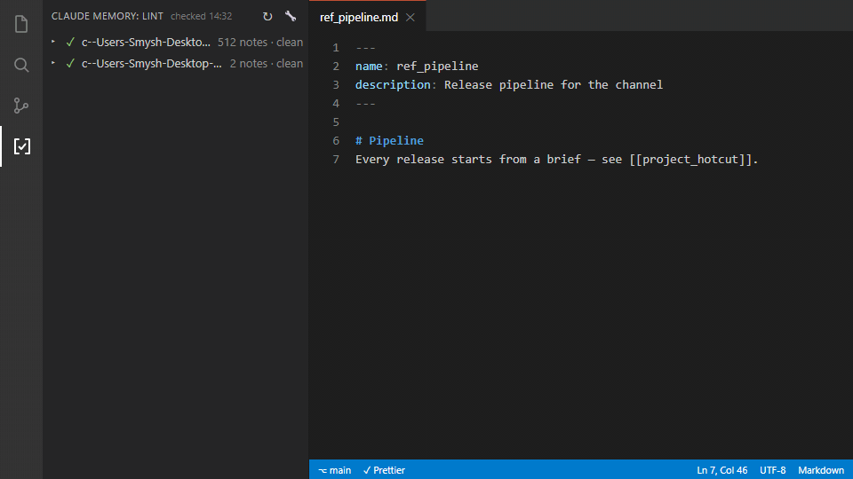

# claude-memory-lint

Скрипт, который проверяет ссылки и структуру файловой памяти [Claude Code](https://code.claude.com/docs/en/memory). Помогает найти заметки, к которым потерялся путь, и исправить часть ошибок в именах.

[](https://github.com/Smyshnikof/claude-memory-lint/actions/workflows/ci.yml)
[](https://marketplace.visualstudio.com/items?itemName=smyshnikof.claude-memory-lint-vscode)
[](https://marketplace.visualstudio.com/items?itemName=smyshnikof.claude-memory-lint-vscode)

[English version](README.md)

## Зачем это нужно

В файловой памяти Claude Code хранятся заметки о проектах, предпочтениях и прошлых решениях. По умолчанию папка находится здесь:

```text
~/.claude/projects/<слаг-проекта>/memory/
    MEMORY.md          — оглавление памяти
    project_alpha.md   — заметка о проекте
    feedback_style.md  — предпочтения по стилю
```

Claude загружает начало `MEMORY.md` при старте сессии, а остальные заметки читает по необходимости. Если вы связываете их ссылками, эти связи нужно поддерживать.

Например, две заметки объединили в одну, старый файл убрали, а ссылки на него остались. Или файл называется `project_alpha.md`, а ссылка написана как `[[project-alpha]]`. В обоих случаях ссылка указывает на имя, которого нет на диске.

Это легко пропустить: папка на месте, заметки в ней есть, но часть переходов между ними уже не работает. Claude может найти нужный файл поиском или по другой ссылке, однако рассчитывать на прежний маршрут больше нельзя.

У себя я обнаружил **234 битые ссылки на 145 разных несуществующих имён в папке из 505 заметок**. Часть оставалась незамеченной месяцами. При разборе нашёл массовое расхождение: у 128 заметок поле `name:` содержало имя с дефисами, а файл назывался через подчёркивания. Ссылки, составленные по этому полю, не совпадали с именами файлов.

Для проверки таких ошибок я и написал этот линтер. Он проверяет структуру памяти; достоверность заметок и то, вспомнит ли Claude конкретный факт, он не оценивает.

На момент первого релиза (сентябрь 2026) больше этого не делал никто — ни экосистема, ни сам Claude Code. Anthropic, пожалуйста 😌 Если когда-нибудь сделаете это нативно — этот репозиторий уйдёт на пенсию с почётом: для памяти всех пользователей это будет лучший исход.

## Быстрый старт

Нужен Python 3.8 или новее. Зависимостей нет: весь инструмент — один Python-файл со стандартной библиотекой.

```bash
git clone https://github.com/Smyshnikof/claude-memory-lint
cd claude-memory-lint
python claude_memory_lint.py --list
```

Последняя команда покажет найденные папки памяти и число Markdown-файлов в каждой. Затем проверьте нужную папку, подставив её путь:

```bash
python claude_memory_lint.py "PATH_TO_MEMORY"
```

**Без `--fix` скрипт только выводит отчёт и не меняет файлы.** Если папка памяти одна, путь можно не указывать. Если их несколько, выберите одну или используйте `--all`.

В macOS и Linux вместо `python` может понадобиться `python3`.

## Команды

```bash
python claude_memory_lint.py              # проверить автоматически найденную папку, если она одна
python claude_memory_lint.py "PATH"       # проверить указанную папку
python claude_memory_lint.py --all        # проверить все найденные папки памяти
python claude_memory_lint.py --list       # показать папки и число заметок
python claude_memory_lint.py "PATH" --json # вывести отчёт в JSON
python claude_memory_lint.py "PATH" --fix  # исправить часть ошибок и проверить снова
```

Автопоиск просматривает `~/.claude/projects/*/memory/`. Если память хранится в другом месте, укажите путь явно.

Пример отчёта:

```text
✗ ~/.claude/projects/my-project/memory
  505 notes, 3 issues

  broken-link: 2  (2 fixable with --fix)
    project_alpha.md:18  [[project-beta]] does not exist -> did you mean [[project_beta]]?
    ref_sources.md:16  [[tone-of-voice]] does not exist -> did you mean [[feedback_tone_of_voice]]?

  orphan: 1
    ref_stray_finding.md  unreachable from MEMORY.md - nothing links here
```

В отчёте указаны файл, строка и причина замечания. Для части битых ссылок скрипт предлагает замену.

## Расширение VS Code


Те же проверки — панелью в редакторе:
[**Claude Memory Lint** в Marketplace](https://marketplace.visualstudio.com/items?itemName=smyshnikof.claude-memory-lint-vscode)
— значок в Activity Bar с бейджем-счётчиком, список находок с переходом к
строке, подчёркивания в редакторе, Ctrl+клик по `[[ссылкам]]`, автопроверка
при старте и при сохранении. Читает только `~/.claude/projects/*/memory/`,
без сети и телеметрии.



Исходники — в [`vscode-extension/`](vscode-extension/).

## Что проверяет

| Проверка | Что означает |
|---|---|
| `broken-link` | Ссылка `[[имя_заметки]]` указывает на несуществующее имя файла |
| `broken-path` | Относительная Markdown-ссылка на `.md` указывает на отсутствующий файл |
| `orphan` | До заметки нельзя добраться по распознанным ссылкам от `MEMORY.md` |
| `frontmatter` | В начале заметки нет блока метаданных между строками `---` |
| `name` | Поле `name:` отсутствует или отличается от имени файла без `.md` |
| `description` | Поле `description:` отсутствует или пустое |
| `duplicate` | Несколько заметок используют одно значение `name:` |
| `no-entry` | Не найден входной файл, по умолчанию `MEMORY.md` |
| `empty` | В проверяемой папке не найдено заметок с учётом исключений |

**Проверка сирот учитывает цепочки ссылок.** Заметке необязательно иметь прямую ссылку из оглавления. Маршрут `MEMORY.md → тематический индекс → заметка → другая заметка` тоже считается. Недостижимость означает отсутствие пути в распознанном графе, а не доказательство того, что Claude никогда не найдёт файл.

**Совпадение `name:` с именем файла — правило этого линтера.** Оно помогает избежать путаницы при составлении ссылок. Это не универсальное требование Claude Code: если вы используете в `name:` произвольный заголовок, проверка будет выдавать замечания. Отдельного переключателя для отключения только этого правила сейчас нет.

Корневой файл и индексы `index-*.md` / `index_*.md` участвуют в обходе ссылок, но освобождены от проверок метаданных.

### Границы проверки

- Скрипт читает `.md`-файлы непосредственно в указанной папке, без рекурсивного обхода подпапок.
- Поддерживает простые ссылки `[[имя_файла]]`. Синтаксис Obsidian с псевдонимами и якорями внутри wikilinks не поддерживается.
- В Markdown-ссылке вида `[текст](file.md#раздел)` проверяет существование `file.md`. Наличие самого раздела не проверяет.
- Ссылки в обычных инлайн-фрагментах кода и блоках из трёх обратных кавычек пропускает. Это простой разбор текста, а не полноценный Markdown-парсер.
- Не проверяет актуальность фактов, противоречия между заметками или качество ответов Claude.

## Как работает `--fix`

**Перед исправлением скопируйте папку памяти. `--fix` записывает изменения прямо в исходные файлы и не создаёт резервную копию.** Сначала запустите обычную проверку и посмотрите отчёт.

Скрипт может:

- заменить битую wikilink-ссылку, если при сравнении без учёта регистра и разделителей найден единственный вариант: `[[my-note]]` → `[[my_note]]`;
- подобрать имя без префикса типа заметки: `[[tone-of-voice]]` → `[[feedback_tone_of_voice]]`;
- привести существующее поле `name:` к имени файла без расширения.

При подборе сначала используется совпадение полного имени после нормализации; если его нет — вариант без префикса. Несколько совпадений на одном этапе не дают автоматической замены. Кириллические буквы сохраняются при сравнении, как и латинские.

Скрипт не восстанавливает удалённые заметки, не исправляет относительные Markdown-пути, не сочиняет `description:` и не добавляет отсутствующий блок метаданных или поле `name:`. Сироты и остальные замечания требуют ручного разбора. После `--fix` проверка запускается повторно и показывает оставшиеся проблемы.

## Настройки и исключения

Необязательный файл `.memory-lint.json` кладётся в проверяемую папку рядом с заметками:

```json
{
  "entry": "MEMORY.md",
  "allow_dangling": ["zametka-kotoruyu-eshe-napishu"],
  "ignore": ["scratch_*.md"],
  "index_glob": ["index-*.md", "index_*.md"]
}
```

- `entry` — файл, с которого начинается обход ссылок.
- `allow_dangling` — имена ещё не созданных заметок, ссылки на которые оставлены намеренно.
- `ignore` — шаблоны имён файлов, полностью исключаемых из проверки и графа ссылок.
- `index_glob` — шаблоны имён индексов, для которых не проверяются метаданные. Заданный список заменяет стандартный.

Исключение файла через `ignore` не отключает отдельное правило: файл целиком выпадает из проверки, а ссылки на него могут стать битыми. Для намеренно отсутствующей цели используйте `allow_dangling`.

## Автоматическая проверка

После проверки код выхода `0` означает отсутствие замечаний, `1` — наличие проблем. Ошибки аргументов командной строки возвращают `2`. После `--fix` результат определяется повторной проверкой.

Например, если копия памяти хранится в репозитории, в CI можно добавить шаг:

```yaml
- run: python claude_memory_lint.py ./memory-backup
```

Python, скрипт и проверяемая папка должны быть доступны в окружении CI. Аналогичную команду можно запускать из git-хука перед коммитом.

## Тесты

```bash
python -m unittest discover -s tests -v
```

В наборе 27 тестов на временных папках памяти. В GitHub Actions настроены прогоны на Linux и Windows с Python 3.8 и 3.12.

## Лицензия

[MIT](LICENSE).
